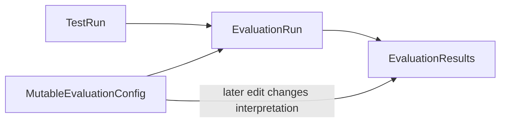
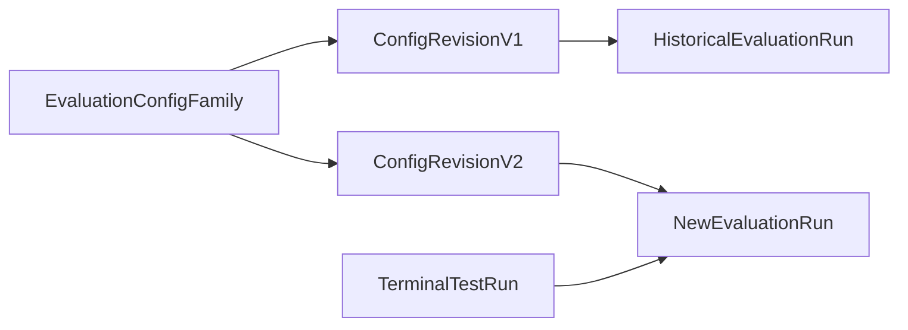

# Evaluation Governance, Immutable Versions, and Validity Proposal

## Problem

Evaluation runs are intended to be reproducible records of how a model response
was assessed. The current design has four gaps:

1. Sensitivity/specificity calculation assigns the negative-class outcomes to
   the wrong confusion-matrix cells.
2. An evaluation can be launched while its source test run is still executing.
   It then assesses only the results that existed when its task began, but can
   still be marked complete.
3. Evaluation configurations are mutable. Editing a config changes the
   criteria used to describe and calculate aggregate statistics for older
   evaluation runs, even though their individual results were produced under
   an earlier definition.
4. Field-match configurations can contain `llm_judge` fields without a judge
   model. Those fields are silently omitted during execution and the run can
   appear complete.

This proposal makes evaluation inputs explicit and historically stable while
keeping Python evaluation scripts as a trusted-admin capability for now.

## Goals

- Calculate true positives, false positives, true negatives, and false
  negatives correctly.
- Only allow an evaluation to start after its test run has reached a terminal
  state.
- Make each saved evaluation-config revision immutable.
- Ensure each `EvaluationRun` remains connected to the exact revision that
  produced its results.
- Make the newest revision of each evaluation configuration easy to select for
  new evaluation runs.
- Reject invalid field-match LLM-judge configurations before they can produce
  incomplete results.
- Preserve existing evaluation configurations and historical evaluation runs
  through a data migration.

## Non-goals

- Sandboxing or restricting Python evaluation scripts. Scripts remain trusted
  code and may make outbound requests; access to edit evaluation configs must
  continue to be limited to trusted users.
- Re-running existing evaluations automatically after a config revision is
  created.
- Changing test-run result data, prompt snapshots, or model execution.
- Supporting incremental assessment of a currently running test run.
- Automatically merging, comparing, or deleting old evaluation revisions.

## Current behaviour



`EvaluationRun` stores only a foreign key to `EvaluationConfig`. The aggregate
metrics and display text are calculated against the currently stored
`scoring_criteria`, rather than a frozen configuration revision.

For field matching, `_field_match_one_result` performs LLM evaluation only
when both `llm_fields` and `judge_model` are present. A missing judge model
therefore omits configured LLM-judge fields instead of failing validation.

## Proposed design



### Evaluation configuration family and revisions

Split the current concept into:

- **Evaluation configuration family:** the stable, researcher-facing identity
  of a scoring recipe, including its project/test case and display name.
- **Evaluation configuration revision:** one immutable definition of that
  recipe, containing evaluation type, scoring criteria, selected judge model,
  and judge prompt.

The preferred persistence model is:

```text
EvaluationConfig
  id
  test_case
  name
  created_by
  created_at

EvaluationConfigRevision
  id
  evaluation_config FK
  version_number
  eval_type
  scoring_criteria
  judge_prompt_template
  judge_model_config FK
  created_by
  created_at

EvaluationRun
  evaluation_config_revision FK
  test_run FK
  ...
```

`EvaluationConfigRevision` has a database uniqueness constraint on
`(evaluation_config, version_number)`. New revisions are allocated in a
transaction, using a row lock on the parent configuration or equivalent
database-safe sequencing. This avoids two concurrent edits producing the same
revision number.

`EvaluationRun` references a revision directly. Once created, a revision must
never be modified or deleted while any run references it. A configuration
family may be renamed only if that is accepted as a presentation-only change;
the initial implementation should treat the family name as stable so
historical output is simpler to audit.

### Creating and editing configurations

Creating a configuration creates:

1. an `EvaluationConfig` family; and
2. revision `1`.

Editing a configuration does not update its existing revision. Instead it:

1. displays the latest revision as the editable starting point;
2. validates the submitted definition;
3. creates the next revision; and
4. redirects to the latest revision’s detail/edit page with a message such as
   “Created revision 3; revision 2 remains unchanged.”

The configuration list and test-run evaluation form show only the newest
revision of each family by default, with a `vN` label. A revision-history
section links to older revisions and shows which evaluation runs used each one.
Historical evaluation-run detail pages must display the revision number and
must continue to calculate descriptions and aggregate metrics from that linked
revision.

### Migration and backwards compatibility

Use Django migration generation tools; do not hand-write schema migrations.
The data migration must:

1. create one configuration family for every existing `EvaluationConfig`;
2. create revision `1` containing every current configuration field;
3. migrate each `EvaluationRun` foreign key to the corresponding revision;
4. retain the existing configuration identifiers where practical, or maintain
   a deterministic mapping during the migration;
5. remove or repurpose the old mutable columns only after all production code
   reads revisions.

The migration should be reversible where feasible, but production backups
remain required before deployment because a relation is being rewritten.

No `EvaluationResult` data changes are necessary: results already belong to an
`EvaluationRun`, which will now refer to an immutable revision.

### Terminal test-run eligibility

An evaluation may start only if the source `TestRun.status` is one of:

- `completed`
- `failed`
- `cancelled`

This permits researchers to assess partial results after a failed or
cancelled run, while preventing the race where rows arrive after an
evaluation is marked complete.

The test-run detail UI must hide or disable “New evaluation” for `pending` and
`running` runs, explain that evaluation becomes available when the run stops,
and update the control when the page refreshes.

This cannot be client-side only. `EvaluationRunCreateView` must enforce the
same condition on both GET and POST because a user can submit a stale browser
form or call the endpoint directly. For a non-terminal run, it returns a
clear message and creates no `EvaluationRun`.

### Field-match LLM-judge validation

When a field-match revision contains any field with:

```json
{"match_type": "llm_judge"}
```

the revision must include a visible, active judge-model configuration. Both
the create and revision-edit views reject invalid submissions with a field
error. The evaluation-start view additionally rejects invalid legacy
revisions as defence in depth.

The worker task should retain a defensive validation check. If an invalid
revision somehow reaches the task queue, the evaluation run must be marked
failed with a visible explanation rather than completed with missing
assessments.

### Correct confusion-matrix semantics

For every tracked boolean check or field:

| Ground truth | Evaluation prediction | Correct cell |
|---|---|---|
| positive | positive | TP |
| positive | negative | FN |
| negative | positive | FP |
| negative | negative | TN |

The evaluation result is the prediction: `True` means the check/field passed,
and `False` means it did not. Ground truth continues to be taken from the
configured expected-output column using the existing boolean normalization
rules.

The negative branches in `compute_sens_spec` must be corrected to:

```python
elif not ground_truth and eval_passed:
    stats["fp"] += 1
else:
    stats["tn"] += 1
```

Sensitivity remains `TP / (TP + FN)`. Specificity must be `TN / (TN + FP)`;
PPV is `TP / (TP + FP)` and NPV is `TN / (TN + FN)`.

## User experience

### Configuration editor

- Show the family name and current revision, for example
  `Clinical label scoring — v3`.
- Use “Save as new revision” rather than “Save changes.”
- Provide a revision history with creation time, creator, and a link to each
  revision.
- Explain that historical evaluation runs retain their original definition.
- When LLM judge fields exist, require a judge model before allowing save.

### Test-run detail

- Pending/running: show a disabled evaluation control with
  “Available when the run finishes, fails, or is stopped.”
- Completed/failed/cancelled: show the standard “New evaluation” control.

### Evaluation detail and list

- Display the configuration family name and revision number.
- Use the linked immutable revision for the configuration summary, prompt
  display, field labels, metric calculations, CSV export metadata, and any
  future re-run action.

## Implementation areas

| Concern | Location |
|---|---|
| Configuration family/revision models | `core/models.py` |
| Generated schema and data migration | `core/migrations/` |
| Config create, revision edit, history, run eligibility, metrics | `core/views/evaluations.py` |
| Evaluation dispatch and defensive invalid-config handling | `core/tasks.py` |
| Test-run evaluation action | `core/templates/core/testrun_detail.html` |
| Evaluation config form and revision history | `core/templates/core/evaluationconfig_form.html` |
| Evaluation list/detail revision labels | `core/templates/core/evaluationrun_list.html`, `core/templates/core/evaluationrun_detail.html` |
| Existing relation consumers, exports, dashboard, access filters | `core/views/exports.py`, `core/views/dashboard.py`, `core/views/runs.py`, `core/access.py` |
| Tests | `core/tests.py` |

## Testing

Add or update tests for:

1. All four confusion-matrix combinations and the resulting sensitivity,
   specificity, PPV, and NPV.
2. Evaluation-create GET and POST rejection for pending/running test runs.
3. Evaluation-create success for completed, failed, and cancelled test runs.
4. The disabled/available evaluation control in the test-run detail page.
5. Creating a config produces revision 1.
6. Editing a config creates revision 2 without modifying revision 1.
7. An old evaluation run retains revision 1 criteria, judge prompt, judge
   model, and aggregate metric interpretation after revision 2 is created.
8. The new-evaluation picker exposes only the latest revision of each family.
9. Revision history remains visible and access-controlled.
10. Field-match LLM-judge criteria without a judge model are rejected on
    create and revision edit.
11. A malformed legacy revision queued for execution fails explicitly rather
    than silently omitting LLM-judge fields.
12. Existing keyword, AI-judge, human, Python, exports, dashboard, access,
    deletion, and pagination behaviour still works with revision references.

Use mocked LLM clients and task dispatches. Run tests through `uv run` against
the configured test database before merging.

## Rollout and operational considerations

- Back up the production database before the migration.
- Deploy schema/data migration before code that assumes every run has an
  evaluation-config revision.
- Test the migration against a copy of representative production data,
  including historical runs, deleted judge models, and shared projects.
- Do not delete historical revisions by default. Retention is necessary for
  auditability and reproducible reporting.
- Revisions are small JSON/text records, so database storage growth should be
  modest compared with stored attachments and LLM response data.

## Success criteria

- Every evaluation run can be unambiguously tied to the immutable rules that
  produced it.
- Editing a scoring recipe never changes the displayed meaning or aggregate
  metric of a historical evaluation run.
- No evaluation can complete against only a transient subset of a live test
  run.
- An LLM-judged field cannot silently be skipped because no judge model was
  configured.
- Sensitivity, specificity, PPV, and NPV agree with the standard confusion
  matrix for positive and negative cases.
- Existing historical configurations and evaluation runs survive migration.
