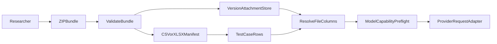

# File Bundle Upload and LLM Attachment Proposal

## Problem

Test cases currently import a CSV or Excel spreadsheet and store only its
`input_*` and `output_*` cell values. Researchers cannot associate a source
document, image, or other file with an individual row, and the LLM client only
sends a text prompt.

Many evaluation tasks need the model to review a source PDF, scan, image, or
text file alongside row-specific prompt fields. This must be simple for
researchers to prepare, safe to upload, and explicit about which configured
models can receive each type of file.

## Goals

- Allow researchers to upload one ZIP bundle containing a CSV/XLSX manifest and
  its referenced files.
- Associate one or more files with each row through spreadsheet columns.
- Store each file once per test-case version, not once per row.
- Initially support attachments that are plain text, CSV, PDF, or image files.
- Send supported attachments to OpenAI, Anthropic, Azure, and configured vLLM
  models using their appropriate request formats.
- Give researchers clear, actionable validation messages before an import or
  run starts.

## Non-goals

- Converting DOCX, XLSX, PowerPoint, audio, video, or arbitrary binary formats.
- Treating every OpenAI-compatible endpoint as capable of receiving every
  attachment type.
- Sending untrusted researcher-controlled URLs to a model provider.
- Retaining the uploaded ZIP as an additional copy after extraction.

New file formats can be added deliberately in later work, with their
validation, storage, provider capabilities, and tests defined at that time.

## Researcher workflow

### Bundle format

The ZIP contains exactly one manifest file (`.csv` or `.xlsx`) and any number
of files in optional subdirectories:

```text
evaluation-bundle.zip
├── cases.csv
├── reports/
│   ├── case-001.pdf
│   └── case-002.pdf
└── images/
    └── case-001-scan.png
```

The manifest continues to use the existing `input_*` and `output_*`
conventions. One or more `file_*` columns add attachments. Each non-empty
cell contains exactly one path relative to the ZIP root:

```csv
input_case_id,input_question,file_report,file_scan,output_answer
001,Summarise the report,reports/case-001.pdf,images/case-001-scan.png,...
002,Summarise the report,reports/case-002.pdf,,...
```

`file_report` and `file_scan` are labels for researchers and prompts; they do
not change the original filename or cause file contents to be added to a text
prompt.

### Allowed attachment types

The initial allow-list is:

- Plain text (`text/plain`, including `.txt` and `.md`)
- CSV (`text/csv`)
- PDF (`application/pdf`)
- Images: JPEG, PNG, GIF, and WebP

The upload page will recommend PDF for documents and CSV for tabular
attachments. The manifest itself may remain CSV or XLSX, matching the existing
import workflow; this does not make XLSX an allowed row attachment.

An unsupported file that is not referenced by a `file_*` cell is ignored and
is not extracted or stored. A referenced unsupported file blocks the complete
import, with its row number, column name, path, and reason shown to the
researcher. This prevents a run from silently omitting a file that the
researcher expected the model to see.

## Import and storage design



### Parsing

Extend the parser result to include `file_columns` and to put the paths from
those columns in a `file_fields` mapping on each parsed row. Existing
standalone CSV/XLSX imports remain unchanged and simply produce no
`file_columns`.

Create a dedicated bundle-import service rather than overloading CSV parsing.
It will:

1. Locate exactly one CSV/XLSX manifest.
2. Parse it through the existing CSV/Excel parser.
3. Normalize referenced paths as POSIX-relative paths.
4. Check that every referenced path exists exactly once in the ZIP.
5. Verify the allow-list by extension and detected MIME type.
6. Extract and store only referenced, allowed files.
7. Return every validation error together before any database rows are
   created.

The importer must reject path traversal, absolute paths, symbolic links,
encrypted ZIP entries, duplicate normalized paths, excessive file counts,
excessive compressed/uncompressed size, and suspicious compression ratios.
File count and size limits should be Django settings so deployments can set an
appropriate local policy.

### Persistence

Add a `TestCaseAttachment` model owned by `TestCaseVersion`. It contains:

- The test-case version
- Normalized ZIP-relative path
- Private storage key / `FileField`
- Verified MIME type
- Byte size
- SHA-256 checksum

Add `file_columns` to `TestCaseVersion` and `file_fields` to
`TestCaseRow`. `file_fields` holds the column-to-relative-path mapping; it
does not duplicate file bytes or provider file identifiers.

Files are stored below a private, version-specific storage prefix. They are
removed with their version through model/storage cleanup. The ZIP is used only
as import staging and is not persisted, avoiding a second copy of the bundle.

## Provider capability and delivery design

The current `call_llm(prompt: str)` contract is text-only. Replace its
internal request construction with a normalized message-part representation:

```python
TextPart(text=prompt)
AttachmentPart(name=..., mime_type=..., content=...)
```

Provider adapters convert those parts into their API-specific request payload.
The result remains normalized so existing run persistence and evaluation code
continue to consume text, token counts, latency, and errors.

### Capability profiles

File support must be configured per `ModelConfig`, not inferred only from its
provider. Add a capability profile that records the exact accepted attachment
types and request strategy for that configured model/deployment.

Defaults are conservative: a newly created configuration is text-only until
an administrator enables supported types. The test-run form performs a
preflight check across all files referenced by the selected dataset version.
It presents a plain-language warning and prevents the run if any referenced
file cannot be delivered to that model.

This keeps the researcher workflow simple: they select a dataset and model;
the application tells them whether the combination is usable. Researchers do
not need to understand API payload formats.

### Provider behaviour

- **OpenAI:** use its supported file/image input path for the configured model
  and API generation. Do not assume a Chat Completions-compatible endpoint
  also implements the Files or Responses APIs.
- **Anthropic:** use native image, PDF, and plain-text message/file blocks
  where supported. CSV can be delivered as plain text only when within
  configured request limits.
- **Azure OpenAI / Azure AI Foundry:** use only the documented input modes for
  the configured deployment, including image/PDF support where available.
- **vLLM:** require each served model to declare the types it accepts. For
  example, Qwen3.5-9B can be configured for image input when served with its
  multimodal support. It must not be assumed to accept PDF merely because it
  is available in the bundle. PDF is the recommended document format for
  researchers, subject to the selected model's declared capability.
- **Local, Custom, and agent endpoints:** remain text-only unless a dedicated
  adapter and capability profile is added. The UI shows an explicit warning
  rather than attempting an unsupported request.

No file conversion is performed in this release. In particular, DOCX and XLSX
attachments are not accepted; researchers should export them to PDF or CSV as
appropriate.

### Auditability

`TestRunResult` should record attachment metadata sufficient to reproduce the
request without storing duplicate bytes: relative path, checksum, MIME type,
and delivery strategy. It must not store provider file IDs as the sole record,
because those are provider-scoped and may expire.

## User interface

Update the upload form to accept ZIP bundles in addition to CSV/XLSX and add:

- A short folder and `file_*` column example
- The initial attachment allow-list
- The PDF/CSV recommendation
- A statement that unreferenced unsupported files are ignored
- A clear report of all import errors without losing the uploaded form context

On a test-case-version detail page, display the attachment count and referenced
paths. On the run form, show a compatibility summary for the selected model
before submission.

## Implementation areas

| Concern | Location |
|---|---|
| CSV/XLSX field parsing | `core/services/csv_parser.py` |
| ZIP validation and extraction | New `core/services/bundle_parser.py` |
| Test-case upload orchestration | `core/views/cases.py` |
| Upload form and help text | `core/forms.py`, `core/templates/core/testcase_upload.html` |
| Attachment and capability models | `core/models.py` |
| Provider payload construction | `core/services/llm_client.py` |
| Per-row attachment resolution | `core/tasks.py` |
| Model configuration UI | `core/forms.py`, `core/views/model_configs.py` |
| Tests | `core/tests.py` |

## Testing

Add tests for:

1. Existing standalone CSV/XLSX imports remaining unchanged.
2. A valid ZIP with multiple `file_*` columns and a shared attachment used by
   more than one row.
3. Nested relative paths.
4. Missing, unsafe, duplicated, oversized, or MIME-mismatched references.
5. An unsupported unreferenced ZIP entry being ignored.
6. A referenced unsupported ZIP entry blocking the complete import.
7. Attachment cleanup when a test-case version is deleted.
8. Capability preflight blocking incompatible model/file combinations.
9. Payload construction and response normalization for OpenAI-compatible,
   Anthropic, Azure, and declared-capable vLLM configurations.

Use mocked provider HTTP calls so `make test` remains deterministic and does
not send uploaded research data to external services.

## Success criteria

- A researcher can create a ZIP bundle, identify row files using `file_*`
  columns, and import it without manual database or storage work.
- Every referenced file is either delivered to a capable model or the run is
  blocked with a clear explanation.
- Files are private, validated, stored once per dataset version, and removed
  with that version.
- Current text-only datasets, prompts, evaluations, and model configurations
  continue to work.
- `make test` passes with coverage for the new import and provider boundaries.
