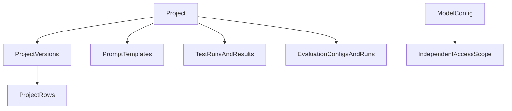

# Project Access Scoping Proposal

## Problem

The application currently uses login as its only access boundary. The
`created_by` fields on projects, model configurations, prompts, runs, and
evaluations are audit metadata: they do not limit list pages, detail pages,
forms, exports, or mutation endpoints. A logged-in user who knows an object
UUID can access it.

This prevents researchers from safely storing private datasets, prompts,
model credentials, inputs, outputs, or evaluation results alongside
generally available resources.

The existing `TestCase` aggregate is the natural boundary for a unit of
evaluation work. This proposal renames it to `Project` and makes it the
access scope for its dataset, prompts, runs, and evaluations.

## Goals

- Rename the `TestCase` aggregate to `Project`.
- Let staff set a project's owner and change a project between private,
  shared, and public.
- Let project owners share a project explicitly with selected users.
- Make private model configurations available only to their owner and users
  explicitly granted access.
- Make public projects and models available to all authenticated users.
- Ensure inaccessible projects, datasets, prompts, models, runs, inputs,
  outputs, and evaluations do not appear in pages, dropdowns, exports, or
  direct URL requests.
- Allow staff to access every resource for administration and support.
- Preserve the database connection discipline documented in
  `docs/DB_CONNECTION_PROPOSAL.md`.

## Non-goals

- Introducing organisations, teams, or organisation-level tenancy.
- Allowing unauthenticated public access.
- Adding database row-level security; Django application authorization remains
  the enforcement layer.
- Changing the structure or storage format of project input rows.
- Sharing individual project rows, prompts, runs, or evaluation results
  independently from their project.

## Terminology and hierarchy

`Project` replaces the user-facing and Python-domain name `TestCase`. A
project is the root container for an uploaded dataset and the work performed
against it.

The following records inherit visibility from their project and therefore do
not require their own visibility fields:

- Project versions and project rows
- Prompt templates
- Evaluation configurations
- Test runs and test-run results
- Evaluation runs and evaluation results

`ModelConfig` remains independently scoped because it can be used by several
projects and contains provider configuration and credentials.

`AgentAsset` remains a system-global, read-only registry cache.

## Visibility and permissions

### Visibility states

Each `Project` and `ModelConfig` has one of these states:

| State | Who can view and use it |
|---|---|
| `private` | Owner and staff only |
| `shared` | Owner, explicitly shared users, and staff |
| `public` | Every authenticated user, plus staff |

New user-created projects and model configurations default to `private`.
Existing objects are migrated as `public` to preserve the current deployment
behaviour. This migration is deliberately compatible rather than silently
locking users out of records they use today.

### Owner and shares

`created_by` is the initial owner. Add explicit share records for projects and
model configurations, each with one of two roles:

| Role | Capabilities |
|---|---|
| Viewer | View, select, run, evaluate, and export the accessible resource and its descendants |
| Editor | Viewer permissions plus update the project/model configuration and create or modify project child resources |

Owners can manage explicit shares. A project that is `private` ignores any
existing share grants until it is changed to `shared`; grants are retained so
the project can be re-shared without reselecting users.

### Staff administration

Staff are the application-level administrators and can access all scoped
objects. On project administration screens, staff can:

- Rename the project
- Change visibility between private, shared, and public
- Select or transfer the project owner using a user search control
- Inspect and update project shares

Staff can perform the equivalent visibility, owner, and share actions for
model configurations. Ownership changes are recorded in the audit trail and
do not silently delete existing share grants.

Regular users cannot set another user as owner or publish a resource. They may
rename projects only when they have editor permission.

## Rename from TestCase to Project

Rename the root model, associated views, forms, templates, labels, navigation,
and routes from `TestCase` to `Project`. `TestCaseVersion` and
`TestCaseRow` should become `ProjectVersion` and `ProjectRow` to keep the
domain vocabulary consistent.

The migration should preserve existing data and foreign-key relationships. It
may retain the underlying database table names initially when that reduces
migration risk. Where routes change, legacy test-case routes should redirect
to the equivalent project routes during a transition period.

Project names remain editable through the project edit form for project
editors and staff. The existing name validation rules apply; if uniqueness is
introduced, it must be checked consistently for create and rename.

## Authorization design

Create one access module, for example `core/access.py`, as the only place that
defines visibility and write rules:

- `visible_projects(user)` and `editable_projects(user)`
- `visible_model_configs(user)` and `editable_model_configs(user)`
- `can_view_project`, `can_edit_project`, and matching model-config helpers
- Derived object querysets that join through the relevant project

All helpers grant staff access first, then evaluate public visibility,
ownership, and an applicable explicit share. They must require an
authenticated user.

Unauthorized direct requests should return HTTP 404, rather than HTTP 403,
so the application does not confirm that a project or run exists.

### Page and endpoint enforcement

Apply scoped querysets and object checks to:

- Project, model, run, and evaluation lists
- Detail, edit, delete, cancel, status, review, and HTMX result endpoints
- CSV/project upload routes
- Run and evaluation creation endpoints
- Run and evaluation exports
- Prompt and evaluation-configuration mutation endpoints

The CSV upload endpoint currently lacks a login requirement. It must require
login and edit permission on the selected target project.

### Dropdown and request validation

All form constructors accept the current user and restrict their model-choice
querysets:

- Project version choices contain only versions of visible projects.
- Prompt and evaluation configuration choices contain only items inherited
  from a visible project.
- Active model choices contain only visible model configurations.
- Dynamic/HTMX prompt options use the same scoped querysets.

Server-side validation must repeat these checks. A crafted POST containing a
valid UUID for an inaccessible model, prompt, project version, or evaluation
configuration must fail without creating a run or leaking details.

## Project/model compatibility

Creating a run requires view/use access to both:

1. The project containing the selected dataset version and prompt.
2. The selected model configuration.

Evaluation creation inherits access from the project. A user may not create a
run or evaluation by combining one accessible resource with another user's
private resource.

Rows, model outputs, prompt snapshots, judge prompts, raw provider responses,
and exports are all protected by the project scope. They cannot be exposed via
a child object's UUID after access is revoked.

## Background work

Run and evaluation tasks receive persisted IDs, so task entry must validate
the submitting user's access to the linked project and model configuration
before executing work.

That validation must happen in the main task thread while loading the run.
LLM worker threads must not query Django ORM to perform per-row authorization:
the database connection proposal specifically prohibits ORM activity in those
threads during external model calls. Workers should receive only already
authorized, materialized input data and in-memory cancellation state.

If a grant is revoked after a run is queued, the revoked user immediately loses
browser access to the run and its results. Already-running work may complete,
but its results stay inside the project and are not exposed to the revoked
user.

## User interface

### Project pages

Project create and edit pages show:

- Name and description
- Visibility state
- Explicitly shared users and their roles
- A searchable user picker for adding shares

For non-staff users, visibility publishing and owner assignment controls are
not displayed. Staff see these controls plus the owner selector.

Project lists identify public/shared/private state without revealing the names
of users with whom the project is shared to ordinary viewers.

### Model pages

Model configuration pages use the same visibility and explicit-sharing
controls. Private model endpoints, provider settings, and encrypted
credentials are never reachable by users without model access. Public model
availability does not make credential fields editable by ordinary viewers;
only the owner, an editor, or staff can edit model configuration.

## Implementation areas

| Concern | Location |
|---|---|
| Project/model models, grants, and migrations | `core/models.py`, `core/migrations/` |
| Central authorization | New `core/access.py` |
| Project/model/run/evaluation views | `core/views/` |
| Form querysets and share controls | `core/forms.py` |
| Project/model/run/evaluation templates | `core/templates/core/` |
| URL and terminology rename | `core/urls.py`, `config/urls.py` |
| Staff administration | `core/admin.py` |
| Background authorization | `core/tasks.py` |
| Tests | `core/tests.py` |

## Testing

Add multi-user tests covering:

1. Private project visibility for owner, unrelated user, and staff.
2. Shared-project access for viewer and editor roles.
3. Public-project access for all authenticated users.
4. Staff visibility changes and owner assignment/transfer.
5. Project rename permission for owner/editor/staff and rejection for viewers.
6. Private/shared/public model selection and model edit permissions.
7. List, detail, direct UUID, export, status, results-partial, review, and
   mutation endpoints returning no data for unauthorized users.
8. Form and HTMX dropdowns excluding inaccessible versions, prompts,
   evaluation configurations, and model configurations.
9. Crafted POST IDs being rejected.
10. CSV upload requiring login and project edit permission.
11. Run/evaluation task entry rejecting work submitted without valid current
    access, without adding ORM calls to LLM worker threads.
12. Existing records being available after the public-visibility backfill.

Use Django test cases with separate users and mocked external model calls.
Run `make test` before merging.

## Success criteria

- A user sees only public resources, resources they own, and resources shared
  with them.
- A private project fully protects its dataset, prompts, input data, outputs,
  runs, evaluations, and exports from other users.
- Private models are absent from inaccessible dropdowns and cannot be selected
  with manually supplied IDs.
- Staff can rename projects, set visibility, and assign owners.
- Project owners can safely share projects with specific users.
- Existing data remains available after migration.
- `make test` passes with multi-user authorization coverage.
